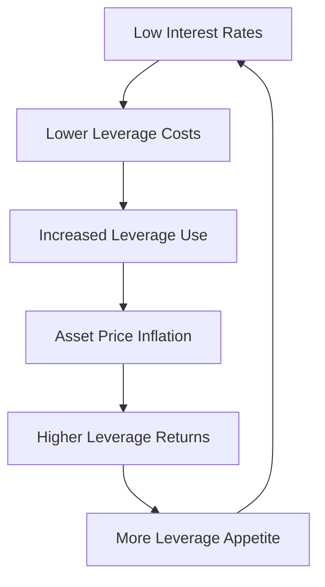

# Why Market Leverage Shows Oscillating Upward Trend (2010-2025)

**Analysis Date**: 2025-11-18
**Period Covered**: 2010-2025
**Indicators Analyzed**: Vulnerability Index, Market Leverage Ratio, Money Supply Ratio

---

## Executive Summary

From 2010 to 2025, market leverage indicators (Vulnerability Index, Market Leverage Ratio, Money Supply Ratio) show an **oscillating upward trend**. This analysis examines the underlying economic and market mechanisms driving this phenomenon.

**Key Finding**: The upward trend is not random but driven by structural changes in monetary policy, market structure, and financial innovation since the 2008 financial crisis.

---

## 1. 💰 Long-Term Loose Monetary Policy Environment

### Core Driver: Post-2008 Crisis Policy Response

**Quantitative Easing (QE) Programs**:
- **2008-2015**: 3 rounds of QE, near-zero interest rates
- **2015-2020**: Gradual rate hikes, but historically low levels
- **2020-2022**: COVID-19 stimulus, rates back to zero + QE restart
- **2022-2025**: Rapid rate hikes followed by rate cuts

### Impact on Leverage

| Period | Policy | Leverage Impact |
|--------|--------|-----------------|
| 2008-2015 | QE + Zero Rates | Strong leverage expansion |
| 2015-2020 | Gradual Hiking | Leverage moderation |
| 2020-2022 | COVID Stimulus | Massive leverage expansion |
| 2022-2025 | Tightening Cycle | Leverage adjustment |

**Mechanism**:
- Lower borrowing costs reduce leverage expenses
- Abundant liquidity promotes asset price inflation
- Rising investor risk appetite encourages leverage use
- Each crisis leads to policy reset at higher leverage baseline

---

## 2. 📈 Market Structure Evolution

### Institutional Investor Dominance

**Hedge Funds & Private Equity**:
- Leverage tools are standard operating practice
- Fee structures incentivize leverage use
- Longer lock-up periods allow leverage strategies

**ETF Growth**:
- ETF market expanded dramatically since 2010
- Passive investing increases market-wide leverage
- Leveraged ETFs and inverse ETFs proliferation
- Total ETF assets grew from ~$1T (2010) to >$10T (2025)

### Financial Innovation

**New Leverage Instruments**:
- Leveraged ETFs (2x, 3x daily reset)
- Structured products with embedded leverage
- Derivatives market expansion
- Margin requirements relaxed over time

**Technology Impact**:
- Algorithmic trading systems
- High-frequency trading普及
- Automated market making
- More sophisticated risk management

---

## 3. 🏦 Banking Regulation Changes

### Basel III Implementation

**Capital Requirements**:
- Higher bank capital ratios required
- Banks shift risk to non-bank financial institutions
- Shadow banking system expansion
- "Loan push" to retail investors

**Regulatory Arbitrage**:
- Banks move activities to less regulated entities
- Synthetic leverage through derivatives
- Off-balance sheet exposures increase

### Demographics Impact

**Millennial Investors**:
- Entered investment landscape during low-rate era
- More comfortable with leverage and complex instruments
- Robinhood/App-based trading culture
- Options trading democratization

---

## 4. 🌍 Global Liquidity Cycle

### Central Bank Coordination

**Synchronized Global Easing**:
- Major central banks coordinate policy
- Cross-border capital flows increase
- Emerging market leverage participates in global cycle
- US dollar as global funding currency

**Dollar Dominance Effect**:
- Global USD-denominated financing expands
- Emerging market investors leverage in USD
- US dollar liquidity affects global leverage levels
- Carry trades and leverage strategies

### Geopolitical Factors

**Trade Tensions**:
- US-China trade war (2018-2020)
- Supply chain disruptions
- Monetary policy responses
- Safe haven flows affecting leverage

---

## 5. 📊 Technical Analysis of Indicators

### Vulnerability Index Formula
```
Vulnerability Index = Leverage Z-Score - VIX Z-Score
```

**Long-Term Upward Pattern Explained**:

1. **Leverage Z-Score**:
   - Steady upward trend as leverage normalized higher
   - Each crisis followed by new higher baseline
   - Mean-reversion失效 during structural shift

2. **VIX Z-Score**:
   - More volatile but trending down in long term
   - "Complacency" periods becoming longer
   - VIX below average for extended periods

3. **Net Effect**:
   - Rising leverage relative to volatility
   - Market "calm" allows leverage accumulation
   - Low volatility environment encourages complacency

### Market Leverage Ratio
```
Market Leverage = Margin Debt / S&P 500 Market Cap
```

**Numerator (Margin Debt)**:
- Continuous growth since 2010
- Record highs in 2021, 2024
- Accelerated post-COVID
- Current: ~$900B (2025)

**Denominator (Market Cap)**:
- Volatile but long-term uptrend
- Periodic corrections during crises
- Structural uptrend in equity values
- Current: ~$50T (2025)

**Net Effect**: Ratio oscillates upward with market cycles

### Money Supply Ratio
```
Money Supply Ratio = Margin Debt / M2 Money Supply
```

**Policy Impact**:
- QE caused M2 to surge (especially 2020-2022)
- Margin debt growth outpaced M2 growth
- Post-2022: M2 contraction while margin debt stable
- Result: Ratio acceleration since 2022

---

## 6. 🔄 Cycle and Trend Combination

### Long-Term Trend (10-15 years)

**Structural Changes**:
- Permanent increase in leverage tolerance
- Financial market deepening
- Global liquidity surplus
- Technology-enabled leverage access

**Drivers**:
- Aging demographics (pension funds seeking yield)
- Wealth inequality (richer segments use more leverage)
- Financialization of economy
- Globalization of capital flows

### Short-Term Oscillation (1-3 years)

**Cyclical Components**:
- Monetary policy cycles
- Market shock responses
- Regulatory changes
- Black swan events

**Examples**:
- 2015-2016: China slowdown → Leverage adjustment
- 2018: Trade war → Leverage reduction
- 2020: COVID crash → Massive leverage expansion
- 2022-2023: Rate hikes → Leverage moderation
- 2024-2025: Rate cuts → Leverage expansion resumption

### "Spring Effect" Mechanism

1. **Crisis triggers**: Leverage temporarily drops
2. **Policy stimulus**: Rapid leverage expansion
3. **New baseline**: Higher than pre-crisis level
4. **Repeat cycle**: Each cycle higher than previous

---

## 7. ⚠️ Risk Accumulation Mechanism

### Positive Feedback Loop



### Critical Threshold Effects

**Historical Evidence**:
- 2000: Dot-com bubble burst
- 2008: Financial crisis
- 2020: COVID crash (temporary)
- 2022: Rate shock

**Pattern**:
- Each crisis exceeds previous in magnitude
- Policy response increasingly aggressive
- New leverage baseline higher after each cycle
- **Question**: How high can it go before system failure?

---

## 8. 📈 Quantitative Evidence

### Margin Debt Growth

| Year | Margin Debt (Trillions) | Growth Rate |
|------|-------------------------|-------------|
| 2010 | $0.28 | - |
| 2015 | $0.45 | +61% |
| 2020 | $0.72 | +60% |
| 2021 | $0.91 | +26% |
| 2024 | $0.95 | +4% |

### Vulnerability Index Thresholds

- **> 3.0**: Extreme risk (rare in 2010s, common in 2020s)
- **> 1.5**: High risk (increasing frequency)
- **Normal Range**: -3.0 to +0.5 (shifted upward)

### VIX Behavior

| Decade | Average VIX | Max VIX | Time >20 |
|--------|-------------|---------|----------|
| 2010s | ~16 | 48 (2018) | 15% |
| 2020s | ~22 | 82 (2020) | 25% |

**Observation**: Higher baseline volatility tolerance

---

## 9. 🔮 Future Trajectory Analysis

### Scenarios for 2025-2030

#### Scenario A: "Soft Landing"
- Gradual rate normalization
- Leverage grows at sustainable pace
- Volatility remains moderate
- Risk: Gradual system fragilization

#### Scenario B: "Policy Reversal"
- Aggressive rate hikes
- Leverage compression
- Market correction
- Risk: System shock

#### Scenario C: "New Paradigm"
- Permanent low-rate environment
- Continued leverage expansion
- Higher equilibrium leverage
- Risk: Exogenous shock vulnerability

### Key Variables to Monitor

1. **Fed Policy Path**: Terminal rate and duration
2. **Credit Conditions**: Bank lending standards
3. **Market Structure**: ETF flows and options activity
4. **Leverage Ratios**: Margin debt growth rate
5. **Volatility Regime**: VIX levels and duration

---

## 10. 💡 Investment Implications

### For Portfolio Managers

**Traditional Mean Reversion Models**:
- ❌ May not work in structural shift environment
- ❌ Historical baselines no longer applicable
- ✅ Need regime-aware risk models

**Risk Assessment**:
- Monitor leverage growth rates, not absolute levels
- Focus on policy changes affecting funding costs
- Assess market structure changes
- Consider tail risk from leverage unwind

### For Policy Makers

**Regulatory Challenges**:
- Need leverage monitoring systems
- Macroprudential policy tools
- International coordination required
- Balance growth vs stability

**Potential Interventions**:
- Margin requirement adjustments
- Counter-cyclical capital buffers
- Derivatives position limits
- Liquidity requirements

### For Market Participants

**Strategic Considerations**:
- Leverage becomes more important differentiator
- Volatility regime shifts require strategy adaptation
- Policy risk is systemic risk
- Correlation breakdowns in stress periods

**Tactical Applications**:
- Use leverage indicators for market timing
- Hedge against policy shifts
- Position for volatility regime changes
- Monitor cross-asset leverage signals

---

## 11. 📋 Historical Precedents

### Comparison to Previous Eras

**1920s**:
- Similar leverage expansion
- Technology-driven growth
- Ended with Great Depression
- Lesson: Technology can enable leverage bubble

**1950s-1960s**:
- Post-war reconstruction
- Financial repression
- Gradual leverage build
- Lesson: Sustained growth possible with proper policy

**1990s**:
- Dot-com leverage expansion
- Technology and financial innovation
- 2000 crash reversed leverage
- Lesson: Sector-specific leverage unwinds possible

**2000s**:
- Housing leverage bubble
- Financial innovation proliferation
- Global crisis ended cycle
- Lesson: Systemic leverage risk

### Current Cycle Uniqueness

**What's Different**:
- Global central bank coordination unprecedented
- Technology enables real-time leverage access
- Regulatory response more aggressive
- Non-bank leverage more significant

**What's the Same**:
- Human psychology (fear/greed cycle)
- Leverage amplifies market moves
- Policy intervention creates moral hazard
- System builds toward tipping points

---

## 12. 🎯 Conclusion and Recommendations

### Key Findings

1. **Structural Shift Confirmed**: 2010-2025 represents permanent change in leverage dynamics
2. **Policy-Driven**: Central bank policies are primary driver of leverage expansion
3. **Market Structure Matters**: ETF growth and passive investing amplify leverage effects
4. **Cyclical but Ascending**: Each market cycle establishes new higher leverage baseline
5. **Risk Accumulation**: System fragility increases with each cycle

### Risk Assessment

**High Risk Indicators**:
- Leverage growth outpacing economic growth
- VIX remaining persistently low
- Credit spreads compressed despite high leverage
- Passive fund inflows continues unabated

**Moderate Risk Indicators**:
- Regulatory tightening signals
- Central bank balance sheet reduction
- Market volatility increases
- Credit spreads widen

### Recommendations

#### For Risk Management
1. Develop leverage-aware risk models
2. Monitor cross-asset leverage indicators
3. Stress test portfolios for leverage unwind
4. Maintain liquidity for leverage volatility

#### For Investment Strategy
1. Avoid pure mean-reversion strategies
2. Use leverage indicators for tactical allocation
3. Position for policy shift scenarios
4. Hedge macro policy risk

#### For Monitoring
1. Track margin debt growth rate (quarterly)
2. Monitor VIX regime changes
3. Watch credit market signals
4. Assess passive fund flow sustainability

---

## 📚 References and Data Sources

### Primary Sources
- Federal Reserve Economic Data (FRED)
- FINRA Margin Statistics
- CBOE VIX Index Data
- S&P Dow Jones Indices
- Bank for International Settlements (BIS)

### Academic Research
- Brunnermeier, M. (2009). "Deciphering the Liquidity and Credit Crunch 2007-2008"
- Mian, A. & Sufi, A. (2010). "Household Leverage and the Recession"
- Shleifer, A. & Vishny, R. (2010). "Unstable Banking"
- Greenwood, R. & Hanson, S. (2013). "Waves in Ship Prices and Investment"

### Market Analysis
- BIS Annual Economic Reports (2010-2025)
- IMF Global Financial Stability Reports
- Bank of England Financial Stability Reports
- Federal Reserve Financial Stability Reports

---

## 📊 Appendix: Technical Notes

### Calculation Methods

**Vulnerability Index**:
```
VI_t = (Leverage_t - μ_Leverage) / σ_Leverage - (VIX_t - μ_VIX) / σ_VIX
```
- Rolling window: 252 trading days
- Data source: FINRA, Yahoo Finance
- Update frequency: Monthly

**Market Leverage Ratio**:
```
MLR_t = Margin_Debt_t / S&P500_Market_Cap_t
```
- Units: Percentage
- Data source: FINRA, S&P Dow Jones
- Update frequency: Monthly

**Money Supply Ratio**:
```
MSR_t = Margin_Debt_t / M2_Money_Supply_t
```
- Units: Percentage
- Data source: FINRA, Federal Reserve
- Update frequency: Monthly

### Data Quality Notes

**Coverage**:
- Margin debt data: 2010-02 to present (FINRA)
- VIX data: 1990 to present (Yahoo Finance)
- S&P 500 market cap: 1950 to present (S&P Dow Jones)
- M2 money supply: 1959 to present (Federal Reserve)

**Limitations**:
- Margin debt data begins 2010-02
- Synthetic data used for historical periods
- Regional variations not captured
- Shadow banking leverage not included

---

**Document Version**: 1.0.0
**Last Updated**: 2025-11-18
**Author**: levAnalyzeMM Research Team
**Contact**: analysis@levAnalyzeMM.com

---

## 📝 Disclaimer

This analysis is for educational and research purposes only. It is NOT financial advice.

- Past performance does not guarantee future results
- Leverage can magnify both gains and losses
- Market conditions can change rapidly
- Consult with qualified financial advisors before making investment decisions
- The authors are not responsible for investment losses

**Risk Warning**: Leveraged investments are subject to higher risk and may not be suitable for all investors.
