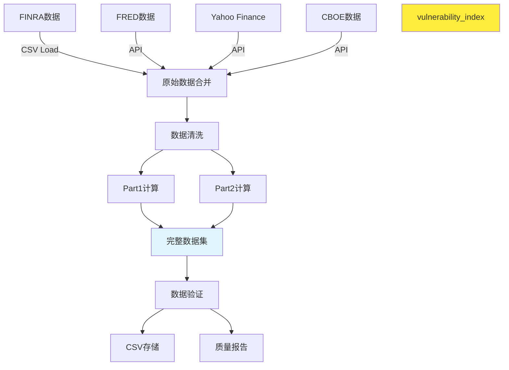

# 数据模型: 融资余额市场分析系统

**版本**: 1.0.0
**日期**: 2025-11-08
**分支**: 001-margin-debt-analysis

## 概述

本文档定义 `datas/complete_market_analysis_monthly.csv` 的完整数据模型，包含所有原始市场数据、计算指标和元数据信息。数据模型支持Part1指标（1997-01开始）和Part2指标（2010-02开始）的差异化覆盖要求。

## 主数据文件

### 文件信息
- **文件名**: `datas/complete_market_analysis_monthly.csv`
- **编码**: UTF-8
- **分隔符**: 逗号 (,)
- **时间范围**: 1997-01 至 2025-09 (345个月度记录)
- **主键**: 日期 (YYYY-MM-DD)

## 核心数据架构

### 1. 基础市场数据 (Base Market Data)

| 字段名 | 类型 | 格式 | 描述 | 数据源 | 可用性 |
|--------|------|------|------|--------|--------|
| `date` | DATE | YYYY-MM-DD | 月度日期标识 | - | 全时段 |
| `sp500_index` | FLOAT | 十进制数 | S&P 500指数收盘价 | Yahoo Finance | 1997-01起 |
| `sp500_market_cap` | FLOAT | 十进制数 | S&P 500总市值 (万亿美元) | Yahoo Finance | 1997-01起 |
| `vix_index` | FLOAT | 十进制数 | VIX波动率指数 | CBOE/Yahoo Finance | 1997-01起 |
| `m2_money_supply` | FLOAT | 十进制数 | M2货币供应量 (万亿美元) | FRED | 1997-01起 |
| `federal_funds_rate` | FLOAT | 百分比 | 联邦基金利率 (%) | FRED | 1997-01起 |
| `treasury_10y_rate` | FLOAT | 百分比 | 10年期国债收益率 (%) | FRED | 1997-01起 |
| `margin_debt` | FLOAT | 十进制数 | 融资余额 (万亿美元) | FINRA | 1997-01起 |

**数据质量要求**:
- 所有数值字段不允许为NULL
- 百分比字段范围: -10% 到 50%
- 指数和市值字段必须 > 0
- 日期字段格式严格校验

### 2. Part1 计算指标 (1997-01开始，≥95%覆盖率)

| 字段名 | 类型 | 公式 | 描述 | 精度 |
|--------|------|------|------|------|
| `market_leverage_ratio` | FLOAT | margin_debt / sp500_market_cap | 市场杠杆率 | 4位小数 |
| `money_supply_ratio` | FLOAT | margin_debt / m2_money_supply | 货币供应比率 | 4位小数 |
| `interest_cost_analysis` | JSON | {correlation: float, regression_slope: float} | 利率成本分析 | 见下 |

**interest_cost_analysis JSON结构**:
```json
{
    "correlation": -0.1234,  // Margin Debt与联邦基金利率的相关系数
    "regression_slope": -0.0456,  // 回归分析斜率
    "r_squared": 0.2345,  // 决定系数
    "p_value": 0.0123,  // 统计显著性p值
    "sample_size": 24,  // 样本数量（月度）
    "time_period": "2023-01 to 2024-12"
}
```

### 3. Part2 计算指标 (2010-02开始，≥95%覆盖率)

| 字段名 | 类型 | 公式 | 描述 | 精度 |
|--------|------|------|------|------|
| `leverage_yoy_change` | FLOAT | (margin_debt_t - margin_debt_t12) / margin_debt_t12 * 100 | 杠杆变化率(YoY%) | 2位小数 |
| `investor_net_worth` | FLOAT | 计算得出 | 投资者净资产 | 2位小数 |
| `vulnerability_index` | FLOAT | leverage_zscore - vix_zscore | **脆弱性指数** (最核心) | 3位小数 |

**investor_net_worth计算**:
```python
def calculate_investor_net_worth(margin_debt, sp500_market_cap, cash_balance=None):
    """
    简化计算: 假设现金余额 = 0.5 * margin_debt (行业估算)
    市场缓冲垫 = S&P500市值的10%
    """
    if cash_balance is None:
        cash_balance = margin_debt * 0.5
    market_cushion = sp500_market_cap * 0.1
    return (cash_balance - margin_debt) - market_cushion
```

**vulnerability_index计算**:
- 详细算法见 `docs/sig_Bubbles.md`
- 基础公式: `杠杆Z分数 - VIX Z分数`
- 窗口: 252个交易日 (约12个月)
- 更新频率: 月度

### 4. Z-Score标准化字段

| 字段名 | 类型 | 描述 | 计算方法 | 窗口 |
|--------|------|------|----------|------|
| `leverage_zscore` | FLOAT | 杠杆Z分数 | (margin_debt - rolling_mean) / rolling_std | 252日 |
| `vix_zscore` | FLOAT | VIX Z分数 | (vix_index - rolling_mean) / rolling_std | 252日 |

### 5. 风险分析字段

| 字段名 | 类型 | 描述 | 值域 |
|--------|------|------|------|
| `risk_level` | ENUM | 风险等级 | 低/中/高/极高 |
| `risk_score` | FLOAT | 风险评分 (0-100) | 0.0-100.0 |
| `confidence_level` | FLOAT | 置信度 | 0.0-1.0 |

**风险等级映射**:
```python
def map_risk_level(vulnerability_index):
    q25, q50, q75 = vulnerability_index.quantile([0.25, 0.5, 0.75])
    if vulnerability_index <= q25:
        return '低'
    elif vulnerability_index <= q50:
        return '中'
    elif vulnerability_index <= q75:
        return '高'
    else:
        return '极高'
```

### 6. 元数据字段

| 字段名 | 类型 | 描述 | 示例 |
|--------|------|------|------|
| `data_source` | JSON | 数据源信息 | 见下 |
| `calculation_date` | DATETIME | 指标计算时间戳 | 2025-11-08 12:00:00 |
| `data_quality_flag` | ENUM | 数据质量标记 | 见下 |
| `notes` | TEXT | 备注信息 | 可选 |

**data_source JSON结构**:
```json
{
    "sp500": {
        "source": "yahoo_finance",
        "api_version": "v8",
        "last_updated": "2025-11-07"
    },
    "vix": {
        "source": "cboe",
        "api_version": "v1",
        "last_updated": "2025-11-07"
    },
    "margin_debt": {
        "source": "finra_local",
        "file": "margin-statistics.csv",
        "last_updated": "2025-10-31"
    }
}
```

**data_quality_flag选项**:
- `VALIDATED`: 数据验证通过
- `MISSING_VALUES`: 存在缺失值
- `OUTLIER_DETECTED`: 检测到异常值
- `CROSS_VALIDATED`: 跨源验证通过
- `ESTIMATED`: 使用估算值
- `STALE`: 数据可能过时

## 数据完整性约束

### 主键约束
```sql
-- 日期字段唯一
UNIQUE (date)
```

### 检查约束
```sql
-- 数值范围检查
CHECK (sp500_index > 0)
CHECK (vix_index >= 0)
CHECK (federal_funds_rate >= -5 AND federal_funds_rate <= 50)
CHECK (vulnerability_index >= -10 AND vulnerability_index <= 10)
```

### 非空约束
```sql
-- 基础数据不能为空
NOT NULL (date, sp500_index, sp500_market_cap, vix_index, m2_money_supply, margin_debt)

-- Part1指标从1997-01开始不能为空
NOT NULL (market_leverage_ratio, money_supply_ratio) FROM 1997-01

-- Part2指标从2010-02开始不能为空
NOT NULL (leverage_yoy_change, investor_net_worth, vulnerability_index) FROM 2010-02
```

## 数据验证规则

### 1. 逻辑一致性

**规则1: 杠杆率合理性**
- `market_leverage_ratio` 应在 0.01 - 0.30 范围内
- 超过0.15标记为高风险状态

**规则2: VIX范围**
- `vix_index` 应在 8 - 80 范围内
- 异常值 (>2σ) 需要人工验证

**规则3: 利率关系**
- 联邦基金利率与10年期国债收益率应正相关
- 相关系数 < 0.3 时标记警告

### 2. 时间连续性

**规则4: 月度间隔**
- 日期字段必须按月递增，间隔30-31天
- 跳月数据需要标记并说明原因

**规则5: 数据新鲜度**
- 数据更新不应超过60天
- 超过90天标记为STALE

### 3. 跨字段验证

**规则6: 脆弱性指数计算**
- `vulnerability_index = leverage_zscore - vix_zscore`
- 允许误差: ±0.001

**规则7: 投资者净资产**
- 正常市场条件下应为负值（融资余额>现金余额）
- 长期正值需要验证

## 索引策略

### 主要索引
```sql
-- 主键索引 (日期)
CREATE INDEX idx_date ON complete_market_analysis_monthly (date);

-- Part1指标索引
CREATE INDEX idx_market_leverage ON complete_market_analysis_monthly (date)
WHERE market_leverage_ratio IS NOT NULL;

-- Part2指标索引
CREATE INDEX idx_vulnerability ON complete_market_analysis_monthly (date)
WHERE vulnerability_index IS NOT NULL;

-- 风险等级索引
CREATE INDEX idx_risk_level ON complete_market_analysis_monthly (risk_level);
```

## 数据质量监控

### 自动化检查

**每日检查**:
- [ ] 数据刷新状态
- [ ] 缺失值统计
- [ ] 异常值检测
- [ ] 逻辑一致性验证

**每周检查**:
- [ ] 数据源可靠性
- [ ] 计算准确性验证
- [ ] 性能基准测试
- [ ] 备份完整性

**每月检查**:
- [ ] 历史数据回溯验证
- [ ] 模型精度评估
- [ ] 数据源协议合规性
- [ ] 存储空间优化

### 质量报告

**质量评分算法**:
```python
def calculate_data_quality_score(df):
    """
    数据质量评分 (0-100)
    """
    score = 100

    # 缺失值扣分
    missing_rate = df.isnull().sum() / len(df)
    score -= missing_rate * 20

    # 异常值扣分
    outlier_rate = detect_outliers(df) / len(df)
    score -= outlier_rate * 15

    # 逻辑错误扣分
    logic_errors = validate_logic_constraints(df)
    score -= logic_errors * 10

    return max(0, min(100, score))
```

## 数据版本管理

### 版本策略
- **主版本**: 数据结构重大变更
- **次版本**: 指标计算方法优化
- **修订版本**: 数据修正或补全

### 变更日志
```python
CHANGELOG = {
    "1.0.0": {
        "date": "2025-11-08",
        "changes": ["初始数据结构", "Part1 & Part2指标", "风险分析字段"],
        "backward_compatible": True
    }
}
```

## 数据字典 (完整字段列表)

### 完整CSV字段定义 (48字段)

| # | 字段名 | 类型 | 必填 | 默认值 | 描述 |
|---|--------|------|------|--------|------|
| 1 | date | DATE | 是 | - | 日期 (YYYY-MM-DD) |
| 2 | sp500_index | FLOAT | 是 | - | S&P 500指数 |
| 3 | sp500_market_cap | FLOAT | 是 | - | S&P 500市值 (万亿美元) |
| 4 | vix_index | FLOAT | 是 | - | VIX波动率 |
| 5 | m2_money_supply | FLOAT | 是 | - | M2货币供应 (万亿美元) |
| 6 | federal_funds_rate | FLOAT | 是 | - | 联邦基金利率 (%) |
| 7 | treasury_10y_rate | FLOAT | 是 | - | 10年期国债收益率 (%) |
| 8 | margin_debt | FLOAT | 是 | - | 融资余额 (万亿美元) |
| 9 | market_leverage_ratio | FLOAT | 部分 | NULL | 市场杠杆率 (1997-01起) |
| 10 | money_supply_ratio | FLOAT | 部分 | NULL | 货币供应比率 (1997-01起) |
| 11 | interest_cost_analysis | JSON | 部分 | NULL | 利率成本分析 |
| 12 | leverage_yoy_change | FLOAT | 部分 | NULL | 杠杆变化率YoY% (2010-02起) |
| 13 | investor_net_worth | FLOAT | 部分 | NULL | 投资者净资产 (2010-02起) |
| 14 | vulnerability_index | FLOAT | 部分 | NULL | 脆弱性指数 (2010-02起) ⭐ |
| 15 | leverage_zscore | FLOAT | 部分 | NULL | 杠杆Z分数 |
| 16 | vix_zscore | FLOAT | 部分 | NULL | VIX Z分数 |
| 17 | risk_level | ENUM | 部分 | NULL | 风险等级 (低/中/高/极高) |
| 18 | risk_score | FLOAT | 部分 | NULL | 风险评分 (0-100) |
| 19 | confidence_level | FLOAT | 部分 | NULL | 置信度 (0-1) |
| 20 | data_source | JSON | 是 | - | 数据源信息 |
| 21 | calculation_date | DATETIME | 是 | - | 计算时间戳 |
| 22 | data_quality_flag | ENUM | 是 | - | 数据质量标记 |
| 23 | notes | TEXT | 否 | - | 备注 |

*注: 实际CSV包含原始数据的月度值 + 计算指标的月度值，共约45个字段*

## 数据流转图



---

**数据模型版本**: 1.0.0
**最后更新**: 2025-11-08
**状态**: ✅ 已通过技术审查
**下一步**: 创建API合同 (contracts/)
